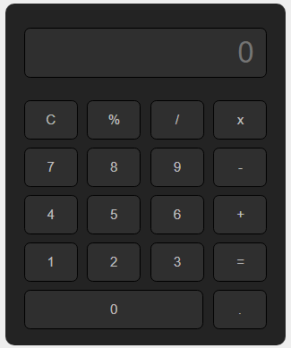

# Project: Simple Calculator
The project is centered on the design and implementation of a simple calculator for educational purpose. 
## Table of Contents
* [General info](#general-info)
* [Screenshots](#screenshots)
* [Technologies](#technologies)
* [Status](#status)
* [Code Examples](#code-examples)
* [Features](#features)
* [Contributing](#contributing)
* [License](#license)
* [Author](#author)
## General Info
The simple calculator project is focused on numbers and arithmetics operations. The end result of the calculator is to provide a correct result of mathematical operation.
## Screenshots

## Technologies
Project is created with:
- HTML5
- CSS3
- JS ES6
## Status
Project is: _in progress_
## Code Examples

```
function oper(value) {
  var result = document.getElementById("result");
  if (result.value.length !== 0) {
     var lastChar = result.value.slice(result.value.length-1);
     var regularExpression = /[0-9]/;
     var re = /^(\+|-|\*|\/|=|>|<|>=|<=|&|\||%|!|\^|\(|\))$/;
     if (lastChar.match(regularExpression) !== null) {
        result.value += value;
     }
     else if (lastChar.match(re) !== null) {
        document.getElementById("result").value = document.getElementById("result").value.slice(0, -1) + value;
     }
  }
}
```

## Features
#### List of features ready and TODOs for future development
* Mathematical operations are working as expected
* Results of operations are correct (with the use of mathematical order of operations)
* Operators cannot be entered more than once if the last character is not a number
* if the user changes his or her mind and decide to change the operator, the calculator will replace the last character (for example from "+" to "-")
* Decimal point or operators cannot be enterd if the result field is empty

#### To-do list:
* Decimal point can be only provided once in one string
* Evaluation after every operation (block mathematical order of operations)
## Contributing
Contributions to the project library are welcome. Please note the following guidelines before submitting your pull request:
 - Follow [JS coding](https://developer.mozilla.org/bm/docs/Web/JavaScript/Guide) standards
 - Write tests for new functions and added featues
## License
Copyright 2018 Martyna Zyskowska
## Author
Martyna Zyskowska
